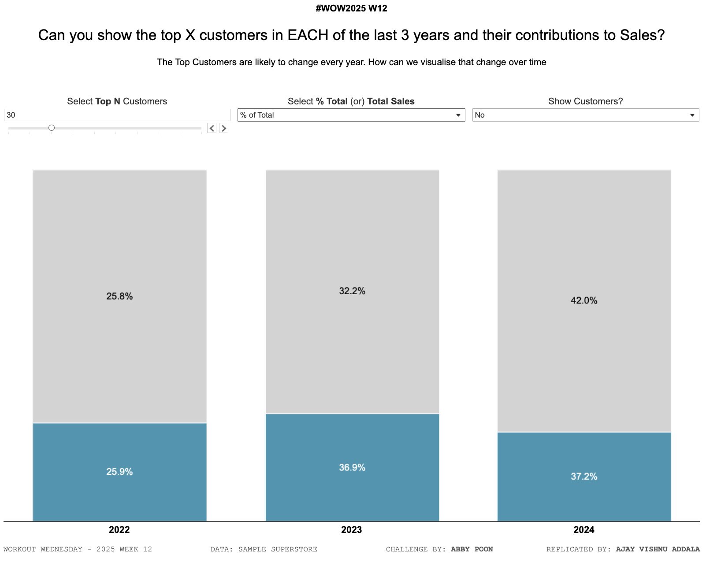

# Workout Wednesday 2025 Week 12: Top X Customers in Each of the Last 3 Years

## Challenge Overview
This challenge focuses on dynamically identifying the top X customers in each of the last 3 years and analyzing their contributions to sales. The solution provides toggles to display either the individual customers or their aggregated contribution as a group.

### Requirements:
1. Create a view to dynamically display the top X customers for each of the last 3 years (based on MAX date).
2. Show either percentage of total sales or total sales values.
3. Include toggles to switch between individual customer data and grouped data.
4. Match labels based on the selected toggle.

### Dataset:
We used the standard Superstore dataset, available [here](https://www.kaggle.com/datasets/fahimfaisal/usa-superstore-data).

---

## Solution Details

### Key Features:
- Dynamic identification of the top X customers in each of the last 3 years.
- Interactive toggles for:
  - Viewing individual customer data.
  - Aggregating contributions into a single group.
- Option to switch between percentage of total sales and absolute sales values.
- Color-coded labels to differentiate between years and customers.

### Dashboard Specifications:
- **Size:** 1000x800 px.
- **Tools Used:** Tableau.
- **Dataset:** Superstore.

### Visualization:
- Bar charts to display customer contributions by year.
- Toggle switches implemented via parameter controls.
- Filters and calculated fields for dynamic year selection and top X logic.

---

## Steps to Recreate

1. **Import the Dataset:**
   - Download and connect the Superstore dataset to Tableau.

2. **Create Calculations:**
   - Create a calculated field for the "Year" based on the order date.
     ```
     YEAR([Order Date])
     ```
   - Create a parameter to select "Top X Customers."
     - Data type: Integer
     - Current Value: 10 (default value)
     - Allowable Values: Range (e.g., 1 to 50).
   - Create a calculated field for Sales Percentage:
     ```
     [Sales] / SUM([Sales]) OVERALL
     ```
   - Use an LOD expression to rank customers dynamically:
     ```
     { FIXED [Year], [Customer Name]: SUM([Sales]) }
     ```

3. **Filter Data for Last 3 Years:**
   - Create a calculated field:
     ```
     IF YEAR([Order Date]) >= YEAR(TODAY()) - 2 THEN "Last 3 Years" END
     ```

4. **Build Views:**
   - Create separate sheets for each visualization (e.g., bar charts, grouped views).
   - Use parameter controls to toggle between individual and grouped views.

5. **Design the Dashboard:**
   - Set the dashboard size to 1000x800 px.
   - Arrange sheets and controls for seamless interactivity.

6. **Publish:**
   - Publish the workbook to Tableau Public.

---

## Tableau Public Link
[View the Tableau Dashboard](https://public.tableau.com/shared/M27W8PK4P?:display_count=n&:origin=viz_share_link)

---

## Snapshot


---

